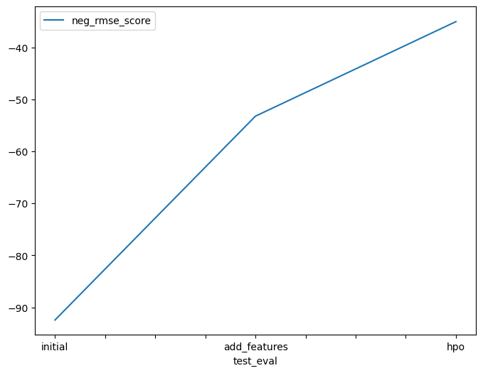
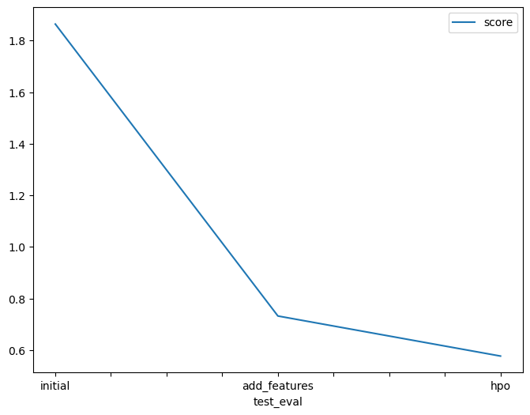

# Report: Predict Bike Sharing Demand with AutoGluon Solution
#### Joel Orellana

## Initial Training
### What did you realize when you tried to submit your predictions? What changes were needed to the output of the predictor to submit your results?

In this first training, no changes were needed due to submission values result were > 0. It's important to highlight that presets='medium_quality_faster_train' were used in the training method, so we were looking to get a medium quality and faster train to avoid a crackdown in training and following recommendations from Udacity Knowledge.

### What was the top ranked model that performed?

The predict.fit_summary() returns the estimated performance of each model so we can get the best models in order, the metric used here, negative mean squared error, is ordered from less to most. And in this case, both models KNeighborsDist and WeightedEnsemble_L2 have the same score_val but KNeighborsDist has less fit_time, so this was the best model.

## Exploratory data analysis and feature creation
### What did the exploratory analysis find and how did you add additional features?

In this case, datetime has a uniform distribution so it's better if we divide this feature in smaller time intervals, it can be more informative and significant in the model training.

We added new features here in smaller time intervals using datetime object properties. AutoGluon originally sees some variables as numbers but we can set manually variables like season and weather as categories.

### How much better did your model perform after adding additional features and why do you think that is?
Best new model has improved from -92 to -53, so loss is decreasing. Manual Feature Engineering has helped the model to get better results in training. 

## Hyper parameter tuning
### How much better did your model perform after trying different hyper parameters?

Loss continues decreasing, now from -53 to -34. 

### If you were given more time with this dataset, where do you think you would spend more time?

I'd spend more time in hyperparameter tuning, especially in the hyperparameters from the last best model. I found that some parameters made the training crashed. So I'd put more resources in the AWS Sagemaker machine and continue exploring. Next thing is we can work with hyperparameter_tune_kwargs that we have set to "auto" (default:None).

### Create a table with the models you ran, the hyperparameters modified, and the kaggle score.
|model|hpo1|hpo2|hpo3|score|
|--|--|--|--|--|
|initial|"default vals"|"default vals"|"CAT: iterations=10000"|1.86412|
|add_features|"default vals"|"default vals"|"RF: n_estimators=500"|0.73217|
|hpo|"default vals"|"default vals"|"XT: n_estimators=500"|0.57683|

### Create a line plot showing the top model score for the three (or more) training runs during the project.

### Create a line plot showing the top kaggle score for the three (or more) prediction submissions during the project.

## Summary

In both graphs we can see the model is improving after each new training. The best kaggle score we got in the last model was 0.57683. The first place actually in the Kaggle Competition is 0.33756. Using AutoGluon we can easily continue improving this result using Hyperparameter tuning and more Feature Engineering Techniques. AutoGluon is a low code ML solution of AWS that has shown great potential.
